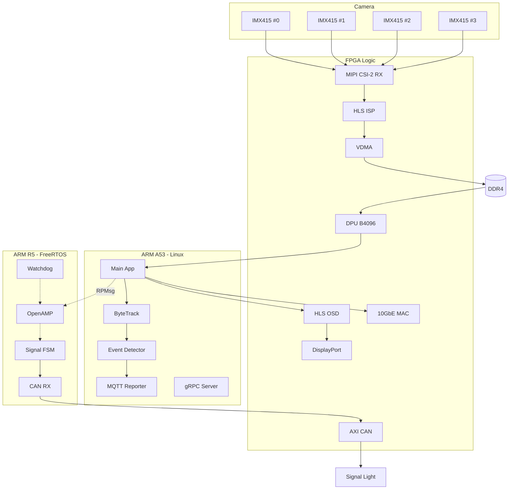
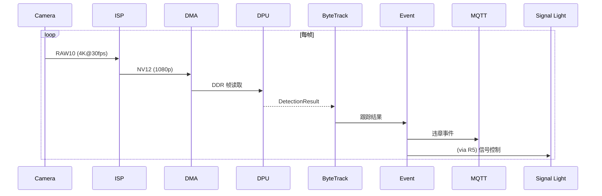
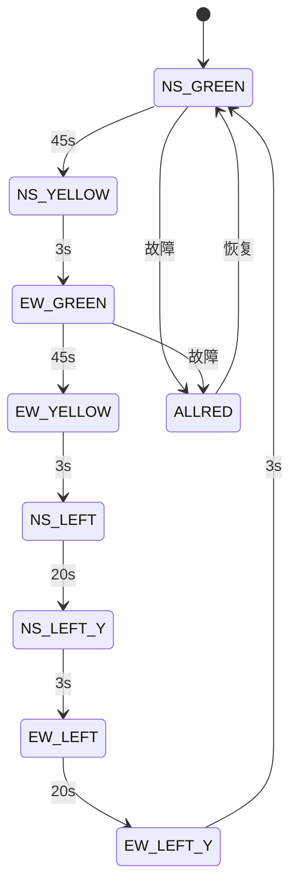

# 架构模型（Mermaid）

> 架构图的源头（single source of truth），由 `tools/sw_hw_toolflow/core/gen_diagrams.py` 编译到 `views/` 中。

## 系统总览

```mermaid
graph TB
    subgraph Camera
        C0[IMX415 #0]
        C1[IMX415 #1]
        C2[IMX415 #2]
        C3[IMX415 #3]
    end

    subgraph PL[FPGA Logic]
        MIPI[MIPI CSI-2 RX]
        ISP[HLS ISP]
        VDMA[VDMA]
        DPU[DPU B4096]
        OSD[HLS OSD]
        ETH[10GbE MAC]
        CAN[AXI CAN]
        DP[DisplayPort]
    end

    subgraph PS_A53[ARM A53 - Linux]
        APP[Main App]
        TRACK[ByteTrack]
        EVENT[Event Detector]
        CLOUD[MQTT Reporter]
        GRPC[gRPC Server]
    end

    subgraph PS_R5[ARM R5 - FreeRTOS]
        SFSM[Signal FSM]
        CANRX[CAN RX]
        WDT[Watchdog]
        OPEN[OpenAMP]
    end

    C0 & C1 & C2 & C3 --> MIPI --> ISP --> VDMA --> DDR[(DDR4)]
    DDR --> DPU --> APP
    APP --> TRACK --> EVENT --> CLOUD
    APP --> OSD --> DP
    APP --> ETH
    APP -.RPMsg.-> OPEN -.-> SFSM --> CANRX --> CAN
    CAN --> TrafficLight[Signal Light]
    WDT -.-> OPEN
```

## 数据流（核心）

```mermaid
sequenceDiagram
    participant Cam as Camera
    participant ISP
    participant DMA
    participant DPU
    participant Track as ByteTrack
    participant Event
    participant Cloud as MQTT
    participant Light as Signal Light

    loop 每帧
        Cam->>ISP: RAW10 (4K@30fps)
        ISP->>DMA: NV12 (1080p)
        DMA->>DPU: DDR 帧读取
        DPU-->>Track: DetectionResult
        Track->>Event: 跟踪结果
        Event->>Cloud: 违章事件
        Event->>Light: (via R5) 信号控制
    end
```

## 状态机：信号灯

```mermaid
stateDiagram-v2
    [*] --> NS_GREEN
    NS_GREEN --> NS_YELLOW: 45s
    NS_YELLOW --> EW_GREEN: 3s
    EW_GREEN --> EW_YELLOW: 45s
    EW_YELLOW --> NS_LEFT: 3s
    NS_LEFT --> NS_LEFT_Y: 20s
    NS_LEFT_Y --> EW_LEFT: 3s
    EW_LEFT --> EW_LEFT_Y: 20s
    EW_LEFT_Y --> NS_GREEN: 3s
    NS_GREEN --> ALLRED: 故障
    EW_GREEN --> ALLRED: 故障
    ALLRED --> NS_GREEN: 恢复
```
